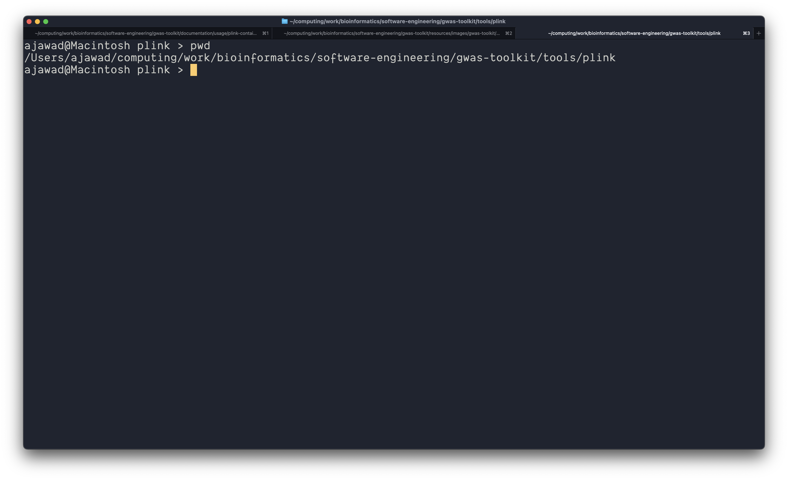
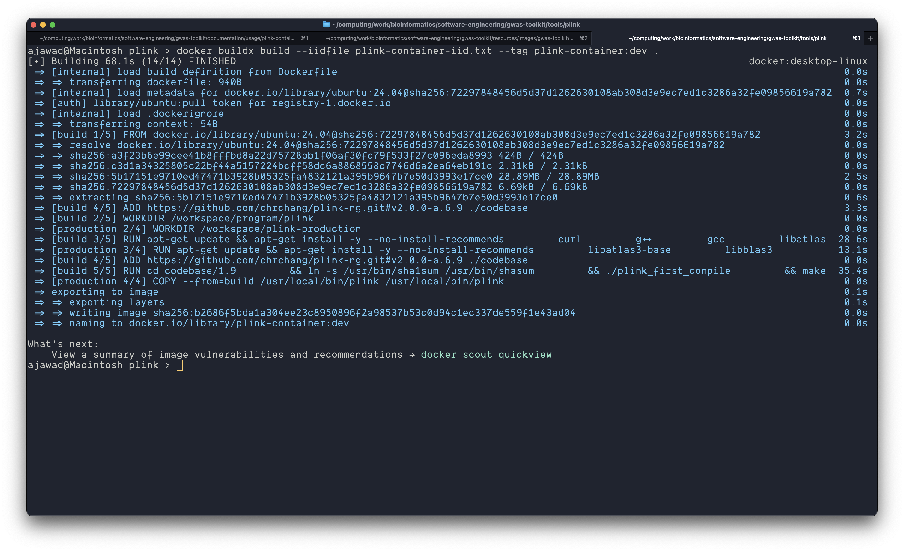
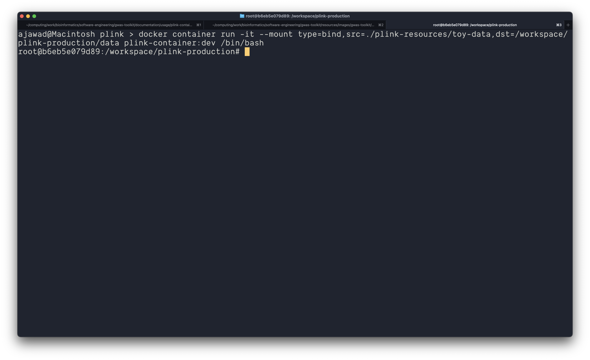
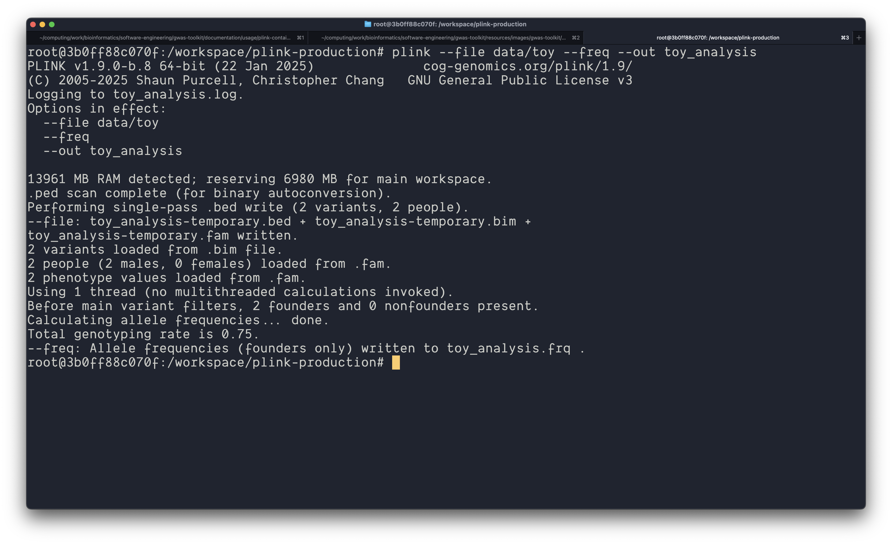

# PLINK Container User Guide

This document provides instructions for building and using a Docker container for PLINK analysis. This guide assumes you have Docker installed on your system and basic familiarity with command-line operations.

## Table of Contents

1. [Prerequisites](#prerequisites)
2. [Setup](#setup)
3. [Building the Container](#building-the-container)
4. [Verifying the Build](#verifying-the-build)
5. [Running the Container](#running-the-container)
6. [Verifying Container Environment](#verifying-container-environment)
7. [Running PLINK Analysis](#running-plink-analysis)
8. [Exiting the Container](#exiting-the-container)
9. [Troubleshooting](#troubleshooting)
10. [Advanced Usage](#advanced-usage)

## Prerequisites

- Docker installed on your system
- The project repository cloned or unzipped
- Basic familiarity with terminal commands

## Setup

1. Navigate to the project's root directory in your terminal.
2. Change to the `tools/plink` directory:

```bash
cd /path/to/gwas-toolkit/tools/plink
```

You should see a file structure similar to what's shown in the following image:



## Building the Container

To build the PLINK Docker container from scratch, use the `docker buildx build` command. This command compiles the container according to the specifications in the Dockerfile.

```bash
docker buildx build --iidfile plink-container-iid.txt --tag plink-container:dev .
```

Parameters explained:
- `--iidfile plink-container-iid.txt`: Saves the container ID to a file
- `--tag plink-container:dev`: Tags the container with the name "plink-container" and version "dev"
- `.`: Specifies that the Dockerfile is in the current directory

During building, you will see output similar to:



The build process includes:
1. Pulling the base Ubuntu image
2. Setting up the working environment
3. Installing dependencies
4. Downloading PLINK source code
5. Compiling PLINK from source

A successful build will end with a message indicating the image has been built and named:

```
=> naming to docker.io/library/plink-container:dev
```

## Verifying the Build

To verify that your container has been built successfully, use:

```bash
docker image ls
```

This command lists all Docker images on your system. You should see your newly built image:

```
REPOSITORY        TAG     IMAGE ID       CREATED         SIZE
plink-container   dev     b2686f5bda1a   3 minutes ago   174MB
```

You can also check the container ID by displaying the contents of the ID file:

```bash
cat plink-container-iid.txt
```

This should show the SHA256 hash of your container:

```
sha256:b2686f5bda1a304ee23c895089f2a9853b53c0d94c1ec337de559f1e43ad04
```

## Running the Container

To run the container with access to your data files, use the `docker container run` command with bind mounting:

```bash
docker container run -it --mount type=bind,src=./plink-resources/toy-data,dst=/workspace/plink-production/data plink-container:dev /bin/bash
```

Parameters explained:
- `-it`: Allocates an interactive terminal for the container
- `--mount type=bind,src=./plink-resources/toy-data,dst=/workspace/plink-production/data`: Creates a bind mount
  - `src=./plink-resources/toy-data`: Source directory on your host machine
  - `dst=/workspace/plink-production/data`: Mount point inside the container
- `plink-container:dev`: The name and tag of the container to run
- `/bin/bash`: The command to execute (starts a bash shell)

When executed successfully, your terminal prompt will change to indicate you're inside the container:



## Verifying Container Environment

Once inside the container, verify your environment:

1. Check your user identity within the container:
   ```bash
   whoami
   ```
   You should see that you're running as `root`:
   ```
   root
   ```

2. Verify your current working directory:
   ```bash
   pwd
   ```
   You should be in the default workspace:
   ```
   /workspace/plink-production
   ```

3. Confirm your data is properly mounted:
   ```bash
   ls -hl
   ```
   You should see a `data` directory.

4. Explore the mounted data:
   ```bash
   cd data
   ls -hl
   ```
   You should see your mounted files, such as toy data files:
   ```
   total 8.0K
   -rw-r--r-- 1 root root 27 Mar 18 14:06 toy.map
   -rw-r--r-- 1 root root 58 Mar 18 14:06 toy.ped
   ```

5. Verify that PLINK is installed and working:
   ```bash
   which plink
   ```
   Output should be:
   ```
   /usr/local/bin/plink
   ```

6. Check the PLINK version:
   ```bash
   plink --version
   ```
   Output should be similar to:
   ```
   PLINK v1.9.0-b.8 64-bit (22 Jan 2025)
   ```

## Running PLINK Analysis

Now you can run PLINK analysis inside the container. Here's a basic example using the toy data:

1. Navigate to your data directory if you're not already there:
   ```bash
   cd /workspace/plink-production
   ```

2. Run a frequency analysis on the toy data:
   ```bash
   plink --file data/toy --freq --out toy_analysis
   ```

The command parameters:
- `--file data/toy`: Specifies the input files (toy.ped and toy.map)
- `--freq`: Requests a frequency analysis
- `--out toy_analysis`: Specifies the output file prefix

You should see output similar to:



3. Verify the output files:
   ```bash
   ls -hl
   ```
   You should see new files including:
   ```
   -rw-r--r-- 1 root root 126 Mar 19 15:50 toy_analysis.frq
   -rw-r--r-- 1 root root 916 Mar 19 15:50 toy_analysis.log
   ```

4. View the analysis results:
   ```bash
   cat toy_analysis.frq
   ```
   This will show the allele frequencies:
   ```
   CHR  SNP   A1  A2      MAF  NCHROBS
   1   rs0    0   C        0       2
   1  rs10    G   A     0.25       4
   ```

5. You can also check the log file for detailed information:
   ```bash
   cat toy_analysis.log
   ```

## Exiting the Container

To exit the container, simply type:

```bash
exit
```

This will return you to your host system's terminal.

## Troubleshooting

### Container fails to build
- Verify that all dependencies are correctly listed in the Dockerfile
- Check your network connection
- Ensure you have sufficient disk space

### Cannot see mounted data
- Double-check the paths in your `--mount` parameter
- Verify the source directory exists on your host system
- Check permissions on the source directory

### PLINK errors during analysis
- Verify that your input files are correctly formatted
- Check that you're using the correct PLINK commands and options
- Examine the log output for specific error messages

## Advanced Usage

### Persisting Output
To save your output files back to your host system, make sure your mount point includes both input and output directories:

```bash
docker container run -it --mount type=bind,src=./my-plink-data,dst=/workspace/plink-production/data plink-container:dev /bin/bash
```

Then run your PLINK analysis in the container with output directed to the mounted directory:

```bash
plink --file data/mydata --freq --out data/my_results
```

### Using Multiple Cores
For larger analyses, you can use PLINK's multi-threading capabilities:

```bash
plink --file data/mydata --freq --threads 4 --out data/my_results
```

### Creating a New Container from Your Session
If you've made changes inside the container that you want to preserve, you can commit the container to a new image:

1. Exit the container
2. Find the container ID:
   ```bash
   docker ps -a
   ```
3. Commit the container:
   ```bash
   docker commit CONTAINER_ID new-plink-image:latest
   ```

### Running Non-Interactive Commands
For automation, you can run PLINK commands without an interactive shell:

```bash
docker container run --mount type=bind,src=./my-data,dst=/workspace/plink-production/data plink-container:dev plink --file /workspace/plink-production/data/mydata --freq --out /workspace/plink-production/data/results
```

This executes the PLINK command and then exits the container.
